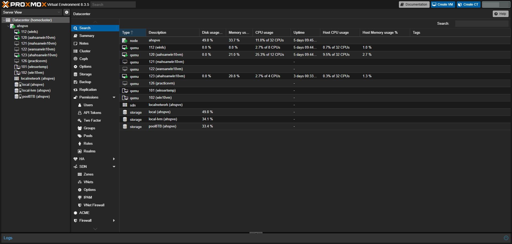
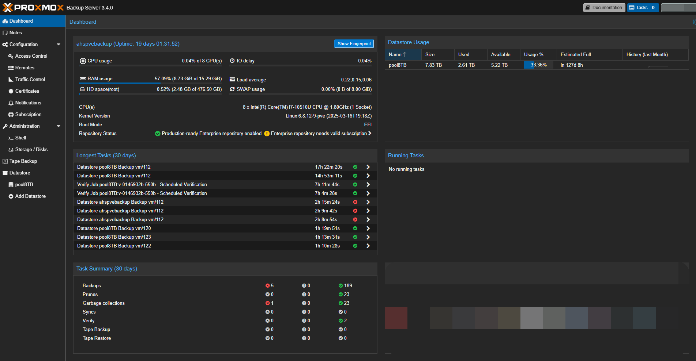

# 🧪 Proxmox VM Backup + Restore Lab

This project documents how I backed up and restored virtual machines using **Proxmox Backup Server (PBS)** inside a VLAN-isolated network environment.

## 🌐 Environment
- Proxmox VE 8
- Proxmox Backup Server 3.1
- VLAN 86 (dedicated backup network)
- External HDD as datastore

## 🎯 Objectives
- Perform full backups for VMs to PBS
- Simulate restore process to a second Proxmox node
- Test backup jobs, pruning, and disaster recovery

## 🗂️ Folder Structure
- `/screenshots/` – Interface + process images
- `/configs/` – PBS job config, network setup files
- `restore-guide.md` – Step-by-step CLI + GUI restore instructions

## 🧠 Learnings
- Importance of VLAN traffic separation
- Backup scheduling and retention strategy
- Restore validation checklist

## 📌 Next Steps
- Automate backup job monitoring
- Sync backups offsite via rclone
- Integrate Grafana for monitoring metrics

## 📸 Screenshots

### 🖥️ Proxmox Dashboard

### 💾 PBS Backup Server – Job Overview

